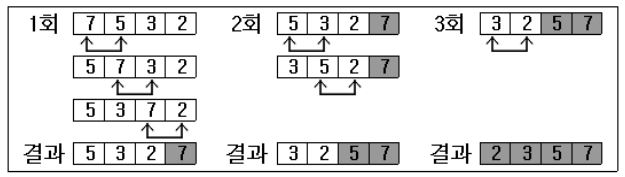

---

## Java Day 11 배열 응용문제 풀이

---

1. **중복 제거 원리**

   로또 추첨기를 만들기에 앞서, 난수을 뽑았을 때 중복된 숫자 없이 원하는 개수만큼 숫자를 뽑는 원리에 대해 아라보자~

   - 핵심은 이중for문을 활용할 것 !
   - 첫번째 for문을 고정시키고 두번째 for문을 돌려 숫자를 비교
   - 중복된 숫자가 나오면 첫번째 for문의 count를 깎아 전 단계로 되돌림 (재추첨)

   ```java
   int[] ex = new int[3]; //예시
   for(int i=0; i<ex.length; i++){
       ex[i] = (int)(Math.random()*4)+1; //1~4 무작위 난수로 배열을 채움
       for(int j=0; j<i; j++){ //비교를 위해선 최소 2개의 숫자가 필요, i=0, j=0일 경우는 skip된다
       	if(ex[i]==ex[j]){
               i--;  //i를 줄여 다시 난수를 뽑는다
               break;  //불필요한 연산을 줄여준다, 하나라도 같으면 뒤에 다 비교할 필요가 없기때문
           }
       }
   } //output : 중복값 없이 1,2,3,4 중 3개의 숫자가 정상 출력된다
   ```

   <br>

2. **버블 정렬**

   

   - 숫자가 4개일때 총 3회차까지 진행

   - 1회차 = 배열의 첫번째값과 두번째값 비교 -> 첫번째가 크면 두 값을 바꿈

     두번째,세번째 비교 / 세번째,네번째 비교 (총 3번 비교)

   - 2회차 = 동일하게 총 2번 비교, 3회차 = 1번 비교

   <br>

   ```java
   int[] bubble = new int[4];

   //배열 bubble에 4개의 무작위 숫자 입력
   for(int i=0; i<bubble.length; i++){
       bubble[i] = System.in.read() - 48;
   }
   System.in.read(); System.in.read();

   //버블정렬 알고리즘
   for(int i=0; i<bubble.length-1; i++){ //총 3회차까지 진행
   	for(int j=0; j<bubble.length-1-i; j++){ //i값을 빼줘서 i가 증가할수록 비교횟수 감소
           if(bubble[j]>bubble[j+1]){ //인접한 두 수를 순차적으로 비교
               int temp = bubble[j]; //배열의 값을 바꿔치기위해 임시저장소 생성
               bubble[j] = bubble[j+1];
               bubble[j+1] = temp;
           }
       }
   }
   ```

   <br>

3. **선택 정렬**

   

   - ~~버블정렬 보다는 쉽다~~
   - 이중 for문으로 순차적으로 비교
   - i와 j 인덱스의 배열값을 비교하여 true면 바꿔치기

   <br>

   ```java
   int[] selection = new int[4];

   //배열 selection에 4개의 무작위 숫자 입력
   for(int i=0; i<selection.length; i++){
       selection[i] = System.in.read() - 48;
   }
   System.in.read(); System.in.read();

   //선택정렬 알고리즘
   for(int i=0; i<selection.length-1; i++){ //총 3회차까지 진행
   	for(int j=i+1; j<selection.length; j++){ //i값을 더해서 i가 증가할수록 비교횟수 감소
           if(selection[i]>selection[j]){ //i고정시키고 j 돌려서 전부 비교
               int temp = selection[i]; //배열의 값을 바꿔치기위해 임시저장소 생성
               selection[i] = selection[j];
               selection[j] = temp;
           }
       }
   }
   ```

   <br>

4. **로또 추첨기**

   대망의 로또추첨기이다. 난수만 6개 뽑으면 될거같은데 생각보다 간단하지가 않다.

   주어진 조건 : 입력한 숫자만큼 로또 추첨, 중복 당연히 안됨, 회차별로 6개의 숫자가 모두 같으면 안됨, 추첨된 숫자는 정렬해서 보여준다

   - 몇 게임 실행할건지 입력 받음
   - 이중배열 생성
   - 난수 생성 로직 구현
   - 중복 제거
   - 이중배열의 행별로 중복 제거(6개 숫자가 모두 같은지)
   - 정렬
   - 출력

   ```java
   import java.io.*;

   public class lotto{
       public static void main(String[] args)throws IOException{
           //숫자 입력받기
           BufferedReader br =
               new BufferedReader(new InputStreamReader(System.in));
           System.out.println("몇 게임 하실?");
           int number = Integer.parseInt(br.readLine());
           //로또 담을 배열 생성
           int[][] lotto = new int[number][6];
           for(int i=0; i<number; i++){
               for(int j=0; j<lotto[i].length; j++){
                   lotto[i][j] = (int)(Math.random()*45)+1; //1~45 무작위 6개 뽑기
                   	for(int k=0; k<j; k++){ //중복 제거
                           if(lotto[i][j] == lotto[i][k]){
                               j--;
                               break;
                           }
                       }//end if
               }//end for j
               int count = 0; //중복 검사를 위한 변수
               for(int z=0; z<i; z++){
                   count = 0;
                   for(int j=0; j<lotto[i].length; j++){
                       for(int k=0; k<lotto[z].length; k++){
                           if(lotto[i][j] == lotto[z][k]){
                               count++;
                               break;
                           }
                       }//end for k
                       if(j == count){
                               break;
                       }
                   }//end for j
                   if(count == 6){ //모두 같으면 해당 행 재추첨
                           i--;
                           break;
                   }
               }//end for z
           }//end for i
           for(int i=0; i<number; i++){
               System.out.print((i+1)+" 번째 추첨번호 : ");
               for(int j=0; j<lotto[i].length; j++){
                   System.out.print(lotto[i][j]+" ");
               }
               System.out.println();
           }
       }//end main
   }
   ```

---

## 참고 자료

---

KG아이티뱅크 자바 강의자료
